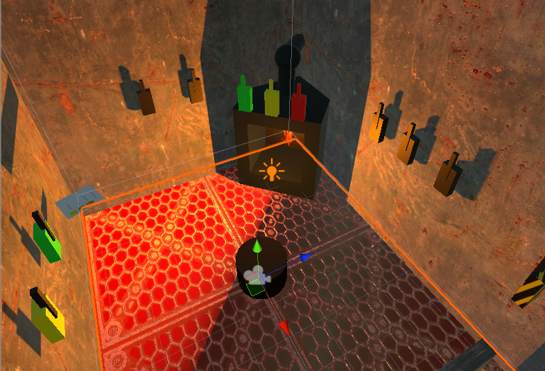
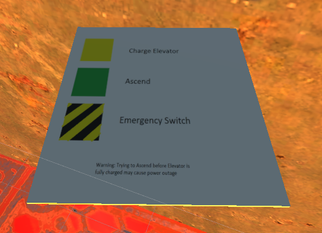

# Elevator Escape

Your trapped in an elevator far below the surface. You have to power the elevator and escape before the alien menace finds you. You can slow them down with traps but the labrynthian tunnels make it difficult to know where to hit. Luckily, you have backup on the outside who have access to the video feeds. Communicate with them and you might just get out alive.

Elevator Escape is a game with two teams, an engineer trapped in an elevator, and a team of observers tasked with saving the engineer. The engineer has to shovel coal to generate power and decide whether to use that power on traps or to ascend. The observers have to help the engineer by directing them with which traps to activate and when.

The game is about communication knowledge.

The engineer is in VR and has all methods of control in the situation

The observers on the other hand have all of the information.

The two teams have to work together to achieve victory!
